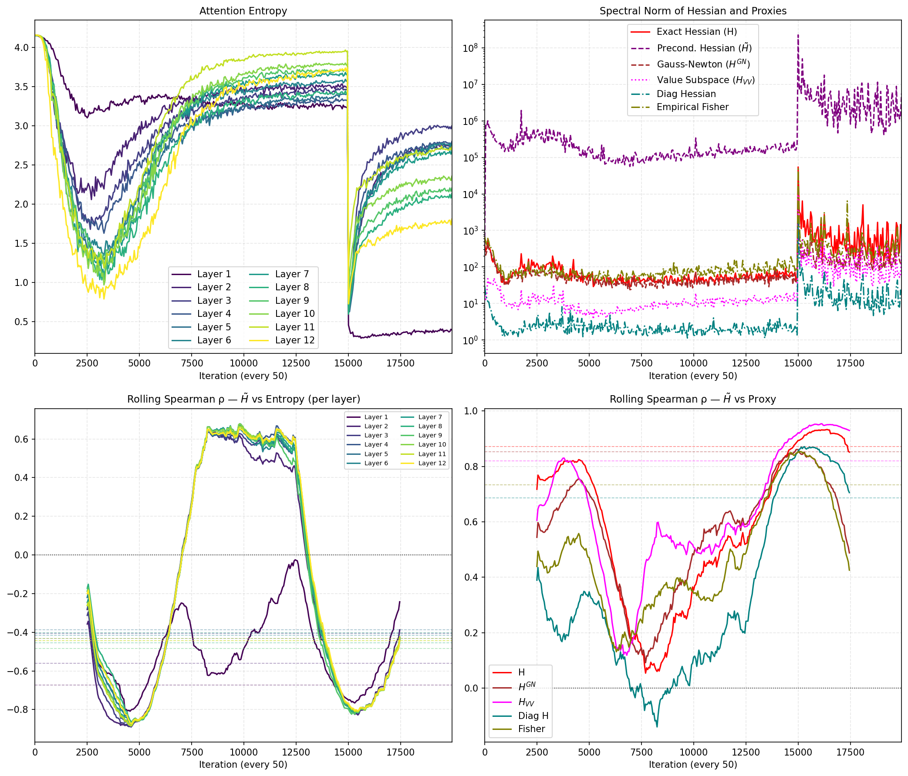

# Entropy Collapse

This repository investigates the relationship between attention entropy collapse and loss-landscape sharpness across two experiments: a Vision Transformer (ViT) and a small GPT-style model (nanochat). Each experiment records attention entropy per layer and a set of curvature proxies during training to enable correlation analyses and plotting of training dynamics.

---

## Repository layout

```
entropy_collapse_supp/
│
├── common/                     # Shared utilities used by both experiments
│   ├── helpers.py              # Curvature metrics and attention-entropy helpers
│   ├── plot_results.py         # Post-training plotting utilities
│   └── __init__.py
│
├── ViT/                        # Vision Transformer experiments
│   ├── base_train.py           # Training entry point for ViT 
│   ├── configs/                # Experiment configuration flags
│   │   └── train_config.py
│   ├── src/                    
│   │   ├── model.py            # HookedViT (timm-based) with attention caching
│   │   └── data_utils.py       # CIFAR / ImageNet data loaders and transforms
│   ├── requirement.txt         # Python deps for ViT
│   └── README.md               # ViT-specific instructions
│
├── nanochat/                   # GPT-style language model experiments
│   ├── base_train.py           # Training entry point for nanochat
│   ├── configs/                # Experiment configuration flags
│   │   └── train_config.py
│   ├── src/
│   │   └── model.py            # HookedGPT with attention caching
│   ├── requirements.txt        # Python deps for nanochat
│   └── README.md               # nanochat-specific instructions
│
└── README.md                   # This file (overview)
```

Installation, dataset preparation, exact training commands, and result reproduction steps are described in each experiment's README: see [ViT/README.md](ViT/README.md) and [nanochat/README.md](nanochat/README.md).

---

## Results


While the Hessian proxies and attention entropy are quite uncorrelated in general, they are strongly correlated in the phase of neural collapse due to natural pre-training or manual temperature shift intervention.
