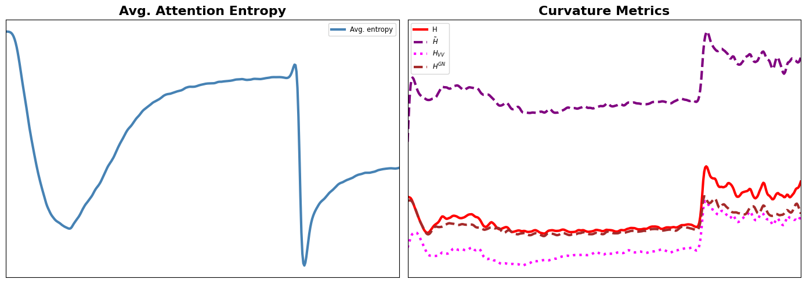

# Entropy Collapse

This repository investigates the relationship between **attention entropy collapse** and **loss landscape sharpness** across two model families: image classification ViTs and a GPT-style language model.  Each experiment tracks a suite of 6 second-order curvature proxies alongside per-layer attention entropy throughout training, enabling correlation analysis between the two phenomena.

---

## Result

Attention Entropy is minimized when the Hessian and its proxies are maximized and correlated.


---

## Repository Structure

```
entropy_collapse/
│
├── common/                       # Shared, model-agnostic utilities
│   ├── helpers.py                # Curvature metrics (CE-loss variant), attention
│   │                             #   entropy, VV-subspace mask, smoothing
│   ├── plotting.py               # Training-dynamics plots, spike detection,
│   │                             #   Spearman/Pearson correlation helpers
│   ├── plot_history.py           # CLI + API: re-run all post-training plots
│   │                             #   from a saved history.pkl (task-aware)
│   └── __init__.py
│
├── ViT/                          # Image classification (CIFAR-10/100, ImageNet)
│   ├── base_train.py             # Training entry-point
│   ├── plot_history.py           # Thin CLI wrapper → common/plot_history.py
│   ├── configs/train_config.py   # All experiment flags
│   ├── src/
│   │   ├── model.py              # HookedViT — timm ViT with attention caching
│   │   ├── data_utils.py         # CIFAR / ImageNet data loaders
│   │   ├── helpers.py            # Local re-exports + path bootstrap
│   │   └── plotting.py           # Local re-exports + path bootstrap
│   ├── requirements.txt
│   └── README.md
│
├── ViT5/                         # Ablation variant of ViT (RoPE, alt. configs)
│   ├── base_train.py
│   ├── plot_history.py
│   ├── configs/train_config.py
│   ├── src/
│   │   ├── model.py              # HookedViT variant with RoPE / additional options
│   │   ├── data_utils.py
│   │   ├── helpers.py
│   │   ├── plotting.py
│   │   └── rope.py               # Rotary position embedding utilities
│   ├── requirements.txt
│   └── README.md
│
├── ViT_depth/                    # Monocular depth estimation (SILog loss)
│   ├── base_train.py
│   ├── plot_history.py
│   ├── configs/train_config.py
│   ├── src/
│   │   ├── model.py              # HookedViTDepth
│   │   ├── data_utils.py
│   │   ├── helpers.py            # SILog loss + depth-specific curvature metrics
│   │   └── plotting.py
│   ├── requirements.txt
│   └── README.md
│
├── nanochat/                     # GPT-style language model (nanochat)
│   ├── base_train.py
│   ├── plot_history.py
│   ├── configs/train_config.py
│   ├── src/
│   │   ├── model.py              # HookedGPT with attention caching
│   │   ├── helpers.py            # LM-specific curvature metrics (reshape logits)
│   │   └── plotting.py
│   ├── requirements.txt
│   └── README.md
│
├── nanoGPT/                      # Reference NanoGPT experiments (exploratory)
│   ├── base_train.py
│   ├── plot_history.py
│   ├── configs/train_config.py
│   ├── src/
│   │   ├── model.py
│   │   ├── data_utils.py
│   │   ├── helpers.py
│   │   ├── plotting.py
│   │   └── tokenizer.py
│   ├── notebook/
│   └── README.md
│
└── README.md                     # This file
```

---

## Code Organisation Logic

The codebase is split into a **shared `common/` layer** and **per-experiment `src/` layers**.

### `common/` — model-agnostic code

Everything that does not depend on the specific task, loss function, or architecture lives here so it is written and maintained once.

| Module | Contents |
|--------|----------|
| `common/helpers.py` | `get_curvature_metrics` (CE / classification variant with all nine proxies), `get_attention_entropy` (arch-aware: detects `model.blocks` vs `model.transformer.h`), `get_VV_subspace_mask` (detects fused-QKV vs separate c_v), `smooth_log_trend` |
| `common/plotting.py` | `plot_training_dynamics`, `plot_curvature_smoothed_comparison`, `plot_all_spike_cooccurrences`, `print_correlations` — all dispatch on a `task=` argument for task-specific axis labels |
| `common/plot_history.py` | `plot_history(pkl_path, ..., task=)` — loads a `history.pkl` and reproduces every post-training figure and the `analysis.md` report; `build_arg_parser()` for per-folder CLI wrappers |

### Per-experiment `src/helpers.py` — task-specific overrides

Each experiment folder's `src/helpers.py` contains only what cannot be shared:

| Folder | What stays local | Why |
|--------|-----------------|-----|
| `ViT/` | path bootstrap, re-exports from `common` | fully delegates to common |
| `ViT5/` | path bootstrap, re-exports from `common` | identical loss and architecture family as ViT |
| `ViT_depth/` | `scale_invariant_log_loss`, `get_curvature_metrics` | depth uses SILog loss; curvature function takes a pre-computed loss tensor |
| `nanochat/` | `get_curvature_metrics` | LM logits are `(B, T, vocab)` and must be reshaped before CE |

`get_VV_subspace_mask` and `get_attention_entropy` are always sourced from `common/helpers.py` — both functions auto-detect the architecture from parameter names and module structure.

### Per-experiment `plot_history.py` — thin CLI wrappers

Each folder's `plot_history.py` is a minimal CLI script that parses arguments and calls `common.plot_history.plot_history(..., task=<task>)`.  All plotting logic lives in `common/`.

---

## Per-experiment READMEs

Installation, data preparation, training commands, and result descriptions are documented in each experiment's own README:

- [ViT/README.md](ViT/README.md) — image classification
- [ViT5/README.md](ViT5/README.md) — ViT ablation with RoPE
- [ViT_depth/README.md](ViT_depth/README.md) — monocular depth estimation
- [nanochat/README.md](nanochat/README.md) — GPT language model
- [nanoGPT/README.md](nanoGPT/README.md) — reference NanoGPT experiments
