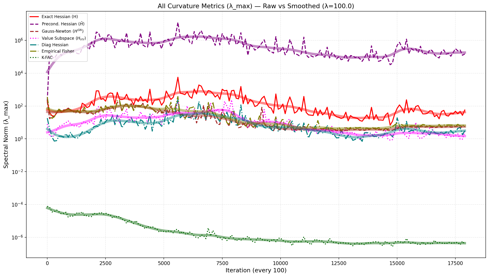
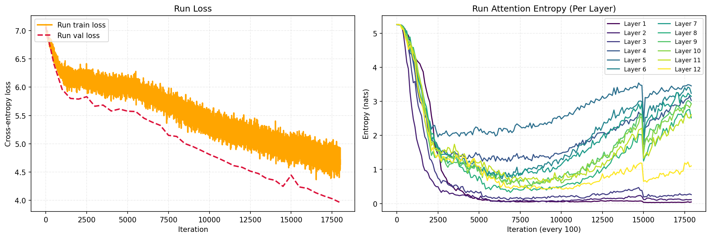
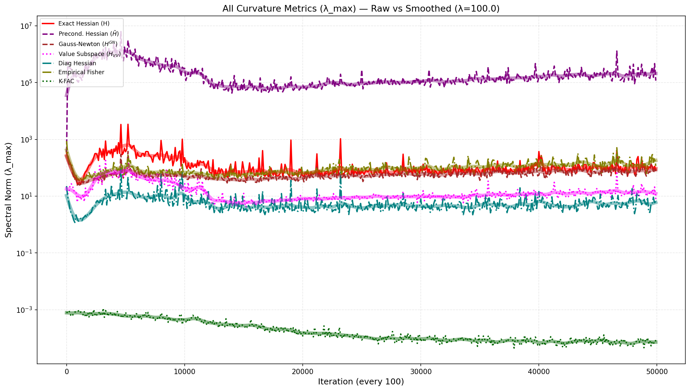
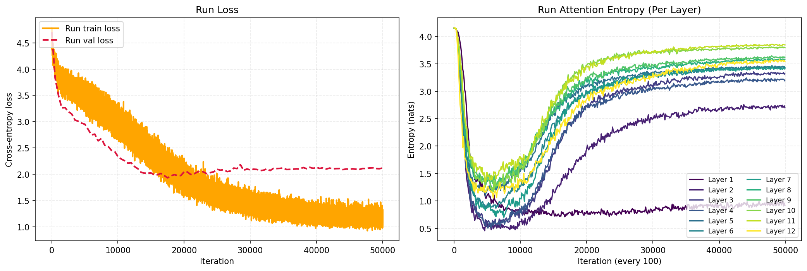

# ViT — Entropy Collapse Experiments

Entropy-collapse analysis for Vision Transformers (ViT), extending
[apple/ml-sigma-reparam](https://github.com/apple/ml-sigma-reparam) with
nine curvature proxies and per-layer attention-entropy tracking.

---

## Quick Setup

### 1. Install dependencies

```bash
# venv
python3.10 -m venv .venv && source .venv/bin/activate
pip install --upgrade pip setuptools wheel
pip install -r ViT/requirements.txt
```

```bash
# Conda
conda create -n entropy-vit python=3.10 -y && conda activate entropy-vit
pip install -r ViT/requirements.txt
```

### 2. Train (default: ViT-B/16 on CIFAR-100)

```bash
python ViT/base_train.py
```

CIFAR-100 is downloaded automatically on first run.

---

## Config Presets

Select a preset with `config=<name>` on the command line.
Each preset is a `@dataclass` defined in `configs/train_config.py`.

| Preset | Model | Dataset | Batch | LR | Max Iters |
|---|---|---|---|---|---|
| `default` / `cifar100_base` | ViT-B/16 (86 M) | CIFAR-100 | 128 | 1e-3 | 50 000 |
| `imagenet1k_base` | ViT-B/16 (86 M) | ImageNet-1k | 256 | 1e-3 | 50 000 |
| `cifar100_large` | ViT-L/16 (307 M) | CIFAR-100 | 64 | 5e-4 | 50 000 |
| `imagenet1k_large` | ViT-L/16 (307 M) | ImageNet-1k | 128 | 5e-4 | 50 000 |
| `cifar100_huge` | ViT-H/14 (632 M) | CIFAR-100 | 32 | 3e-4 | 50 000 |
| `imagenet1k_huge` | ViT-H/14 (632 M) | ImageNet-1k | 64 | 3e-4 | 50 000 |

```bash
python ViT/base_train.py config=imagenet1k_base
bash  ViT/train.sh        config=cifar100_large   # multi-GPU via torchrun
```

---

## Advanced Experiments

### Override individual flags

Any `TrainConfig` field can be overridden on the command line after the preset:

```bash
python ViT/base_train.py config=imagenet1k_base \
    learning_rate=5e-4 \
    max_iters=100000 \
    warmup_iters=10000 \
    hessian_intv=10 \
    entropy_intv=5 \
    wandb_log=true \
    wandb_run_name=vit-b16-imagenet-run
```

### Multi-GPU training

`train.sh` wraps `torchrun`. Set `GPUS` to select devices:

```bash
GPUS=0,1,2,3 bash ViT/train.sh config=cifar100_large
```

### ImageNet-1k via Hugging Face

When `data_dir` does not contain `train/` and `val/` sub-directories the
dataset is downloaded from Hugging Face automatically.

```bash
# Accept the licence at https://huggingface.co/datasets/imagenet-1k first.
export HF_TOKEN=hf_...
python ViT/base_train.py config=imagenet1k_base data_dir=ViT/data/imagenet1k
```

Subsequent runs reuse the local cache.

### Local ImageNet in ImageFolder layout

```bash
python ViT/base_train.py config=imagenet1k_base data_dir=/path/to/imagenet
```

---

## Post-Training Analysis

`plot_history.py` replays a saved `history.pkl` and writes all figures plus
a structured analysis report.

```bash
python ViT/plot_history.py outputs/cifar100_base/history.pkl
```

Outputs written next to the pickle:

| File | Contents |
|---|---|
| `*_curvature_smoothed_comparison.png` | Smoothed proxy traces (λ = 10) |
| `*_training_dynamics.png` | Loss, accuracy, LR schedule |
| `analysis.txt` | Full correlation report (plain text) |
| `analysis.md` | Markdown tables: raw/smoothed correlations, spike co-occurrence |

Override the smoothing strength: `python ViT/plot_history.py history.pkl --lam 20`

---

## Results

### imagenet1k (with temperature shift at 15k-th epoch)

#### Raw Correlations

| Pair        | Spearman | Pearson  |
|-------------|----------|----------|
| H vs Prec_H | 0.9363   | 0.9530   |
| H vs H_VV   | 0.8710   | 0.6869   |
| H vs GN     | 0.6761   | 0.2271   |
| H vs Diag_H | 0.8747   | 0.9030   |
| H vs Fisher | 0.6614   | 0.5349   |
| H vs KFAC   | 0.5420   | −0.0394  |

#### Smoothed Correlations (λ = 100)

| Pair        | Spearman | Pearson  |
|-------------|----------|----------|
| H vs Prec_H | 0.9633   | 0.9775   |
| H vs H_VV   | 0.9495   | 0.9486   |
| H vs GN     | 0.7019   | 0.3186   |
| H vs Diag_H | 0.9409   | 0.9849   |
| H vs Fisher | 0.7568   | 0.4688   |
| H vs KFAC   | 0.6608   | −0.0767  |

#### Spike Co-occurrence — P(X spike | H spike)

| Pair        | z = 1.5 | z = 2.0 |
|-------------|---------|---------|
| H vs Prec_H | 0.636   | 0.812   |
| H vs H_VV   | 0.318   | 0.250   |
| H vs GN     | 0.318   | 0.125   |
| H vs Diag_H | 0.682   | 0.688   |
| H vs Fisher | 0.318   | 0.250   |
| H vs KFAC   | 0.227   | 0.188   |





### cifar100

#### Raw Correlations

| Pair        | Spearman | Pearson |
|-------------|----------|---------|
| H vs Prec_H | 0.6723   | 0.8185  |
| H vs H_VV   | 0.7211   | 0.6583  |
| H vs GN     | 0.3915   | 0.5124  |
| H vs Diag_H | 0.6639   | 0.7933  |
| H vs Fisher | 0.2038   | 0.1238  |
| H vs KFAC   | 0.2296   | 0.3463  |

#### Smoothed Correlations (λ = 100)

| Pair        | Spearman | Pearson  |
|-------------|----------|----------|
| H vs Prec_H | 0.8002   | 0.9456   |
| H vs H_VV   | 0.8588   | 0.9743   |
| H vs GN     | 0.4528   | 0.1784   |
| H vs Diag_H | 0.8381   | 0.8974   |
| H vs Fisher | 0.2817   | −0.0057  |
| H vs KFAC   | 0.0764   | 0.6479   |

#### Spike Co-occurrence — P(X spike | H spike)

| Pair        | z = 1.5 | z = 2.0 |
|-------------|---------|---------|
| H vs Prec_H | 0.339   | 0.306   |
| H vs H_VV   | 0.321   | 0.306   |
| H vs GN     | 0.339   | 0.306   |
| H vs Diag_H | 0.571   | 0.611   |
| H vs Fisher | 0.250   | 0.222   |
| H vs KFAC   | 0.089   | 0.083   |





---

## Key Source Files

| File | Description |
|---|---|
| `base_train.py` | Training entry-point; accepts `config=<preset> key=value …` |
| `configs/train_config.py` | All hyperparameter presets and field definitions |
| `src/model.py` | timm ViT with hooked attention for entropy logging |
| `src/helpers.py` | Nine curvature proxies (H, Prec_H, H_VV, GN, Fisher, K-FAC, …) |
| `src/data_utils.py` | CIFAR-100 / ImageNet-1k data loaders with auto-download |
| `src/plotting.py` | Dynamics plots, spike detection, proxy correlation analysis |
| `plot_history.py` | Post-training CLI: `history.pkl → figures + analysis.{txt,md}` |
